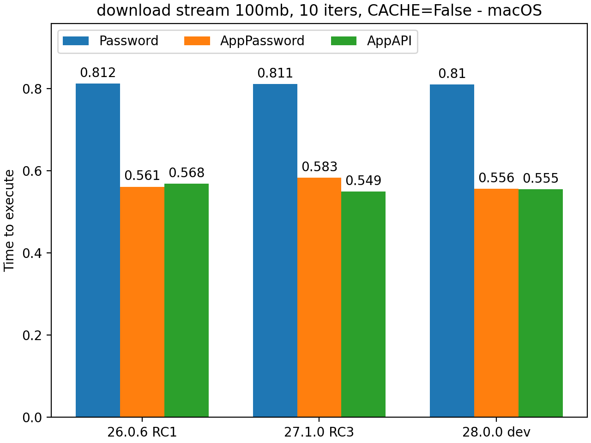

AppAPI Benchmarks
=================

In the current implementation, applications written and using the AppAPI
so far in most cases will be authenticated at the beginning of each action.

It is important to note that the AppAPI authentication type is currently the fastest among available options.
Compared to traditional username/password authentication and app password authentication,
both of which are considerably slower, the AppAPI provides a significant advantage in terms of speed.

When considering data transfer speed, it is worth mentioning
that the AppAPI's upload speed may be slightly lower, around 6-8 percent, for large data transfers.
This decrease in speed is due to the authentication process, which involves hashing all data.
However, for loading any data, there is no slowdown compared to standard methods.

In cases of loading any data, there is no slowdown relative to standard methods.

While the transfer speed can be affected by the network speed between the application and the cloud,
this aspect is beyond the scope of the discussed issue.

Conclusion
----------

In summary, the AppAPI authentication offers fast and secure access to user data.
With the potential addition of a session cache in the future, the authentication process can become even more efficient
and seamless for users. The slight decrease in upload speed for large data transfers
is a trade-off for the enhanced security provided by the authentication process.

Overall, the AppAPI authentication proves to be a reliable and effective method for application authentication.

.. _appapi-bench-results:

Detailed Benchmark Results
--------------------------

Tests on MacOS (M2 CPU) are run when NC is in Docker and `nc_py_api` is in the host.

Tests are run with session cache enabled and disabled to see the difference in authentication speed.

| All benchmarks are run one after the other in the single thread.
| Size of chunk for file stream operations = **4MB**

nc-py-api version = **0.2.0**

'ocs/v1.php/cloud/USERID' endpoint
----------------------------------

.. image:: ../../benchmarks/results/ocs_user_get_details__cache0_iters100__shurik.png

.. image:: ../../benchmarks/results/ocs_user_get_details__cache1_iters100__shurik.png

Downloading a 1 MB file
-----------------------

.. image:: ../../benchmarks/results/dav_download_1mb__cache0_iters30__shurik.png

.. image:: ../../benchmarks/results/dav_download_1mb__cache1_iters30__shurik.png

Uploading a 1 Mb file
---------------------

.. image:: ../../benchmarks/results/dav_upload_1mb__cache0_iters30__shurik.png

.. image:: ../../benchmarks/results/dav_upload_1mb__cache1_iters30__shurik.png

Downloading of a 100 Mb file to the memory BytesIO python object
----------------------------------------------------------------

.. image:: ../../benchmarks/results/dav_download_stream_100mb__cache1_iters10__shurik.png

Chunked uploading of a 100 Mb file from the BytesIO python object
-----------------------------------------------------------------

.. image:: ../../benchmarks/results/dav_upload_stream_100mb__cache0_iters10__shurik.png

.. image:: ../../benchmarks/results/dav_upload_stream_100mb__cache1_iters10__shurik.png
