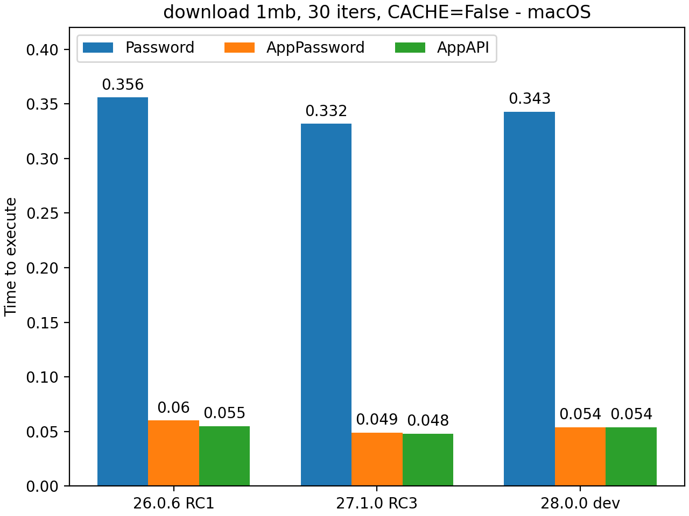

AppAPI Benchmarks
=================

In the current implementation, applications written and using the AppAPI
so far in most cases will be authenticated at the beginning of each action.

It is important to note that the AppAPI authentication type is currently the fastest among available options.
Compared to traditional username/password authentication and app password authentication,
both of which are considerably slower, the AppAPI provides a significant advantage in terms of speed.

In summary, the AppAPI authentication offers fast and robust access to user data.

Overall, the AppAPI authentication proves to be a reliable and effective method for application authentication.

.. _appapi-bench-results:

Detailed Benchmark Results
--------------------------

Tests on MacOS (M2 CPU) are run when NC is in Docker and `nc_py_api` is in the host.

Tests are run with session cache enabled and disabled to see the difference in authentication speed.

| All benchmarks are run one after the other in the single thread.
| Size of chunk for file stream operations = **4MB**

nc-py-api version = **0.2.0**

'ocs/v1.php/cloud/USERID' endpoint
----------------------------------

.. image:: ../../benchmarks/results/ocs_user_get_details__cache0_iters100__shurik.png

Downloading a 1 MB file
-----------------------

Uploading a 1 Mb file
---------------------

.. image:: ../../benchmarks/results/dav_upload_1mb__cache0_iters30__shurik.png

Downloading of a 100 Mb file to the memory BytesIO python object
----------------------------------------------------------------

.. image:: ../../benchmarks/results/dav_download_stream_100mb__cache0_iters10__shurik.png

Chunked uploading of a 100 Mb file from the BytesIO python object
-----------------------------------------------------------------

.. image:: ../../benchmarks/results/dav_upload_stream_100mb__cache0_iters10__shurik.png
