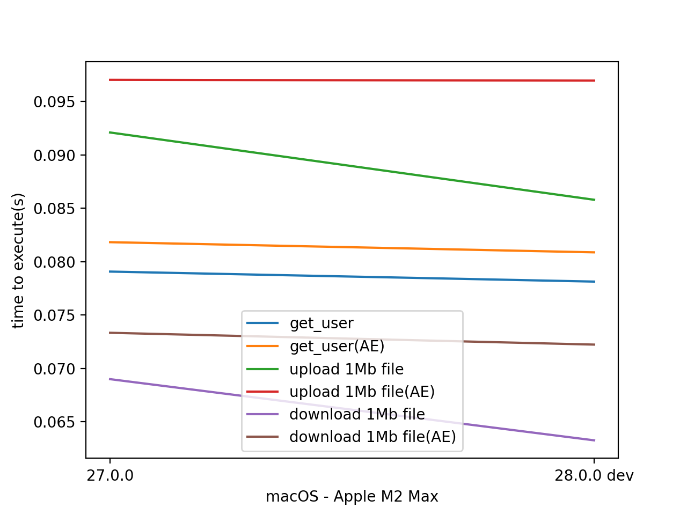
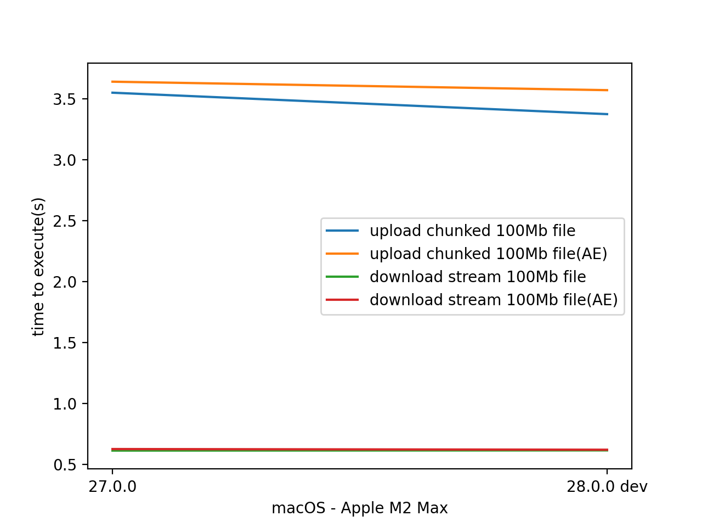

AppEcosystem Benchmarks
=======================

Tests on MacOS (mobile CPU) are run when NC is in Docker and `nc_py_api` is on the host.

Tests on AMD Ryzen were carried out on a desktop CPU, NC is in Docker.

Is there overhead?
------------------

Soon we will know that, currently we in process of gathering this information.

Lightweight operations
^^^^^^^^^^^^^^^^^^^^^^

Heavy operations
^^^^^^^^^^^^^^^^

Size of chunk for file operations = **4MB**

