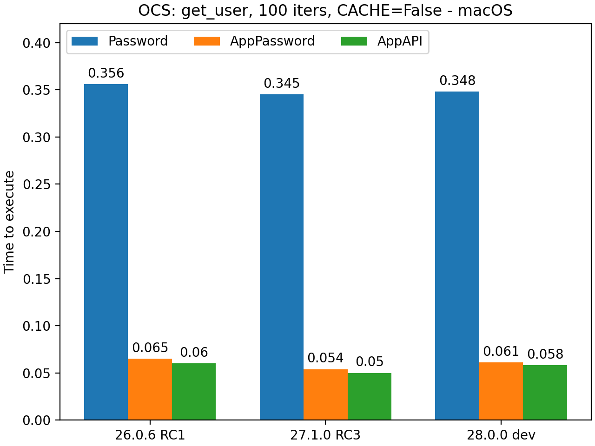

.. _appecosystem-bench-results:

Detailed Benchmark Results
==========================

Tests on MacOS (M2 CPU) are run when NC is in Docker and `nc_py_api` is in host.

Tests on Linux (AMD Ryzen) were done with NC in Docker and `nc_py_api` in WSL.

Tests are run with session cache enabled and disabled to see the difference in authentication speed.

| All benchmarks are run one after the other in the single thread.
| Size of chunk for file stream operations = **4MB**

AMD Ryzen 7900x
^^^^^^^^^^^^^^^

nc-py-api version = 0.0.24

Apple M2
^^^^^^^^

nc-py-api version = 0.0.24

'ocs/v1.php/cloud/USERID' endpoint
----------------------------------

.. image:: ../../benchmarks/results/ocs_user_get_details__cache1_iters100__shurik.png

Downloading a 1 MB file
-----------------------

.. image:: ../../benchmarks/results/dav_download_1mb__cache0_iters30__shurik.png

.. image:: ../../benchmarks/results/dav_download_1mb__cache1_iters30__shurik.png

Uploading a 1 Mb file
---------------------

.. image:: ../../benchmarks/results/dav_upload_1mb__cache0_iters30__shurik.png

.. image:: ../../benchmarks/results/dav_upload_1mb__cache1_iters30__shurik.png

Downloading of a 100 Mb file to the memory BytesIO python object
----------------------------------------------------------------

.. image:: ../../benchmarks/results/dav_download_stream_100mb__cache0_iters10__shurik.png

.. image:: ../../benchmarks/results/dav_download_stream_100mb__cache1_iters10__shurik.png

Chunked uploading of a 100 Mb file from the BytesIO python object
-----------------------------------------------------------------

.. image:: ../../benchmarks/results/dav_upload_stream_100mb__cache0_iters10__shurik.png

.. image:: ../../benchmarks/results/dav_upload_stream_100mb__cache1_iters10__shurik.png
